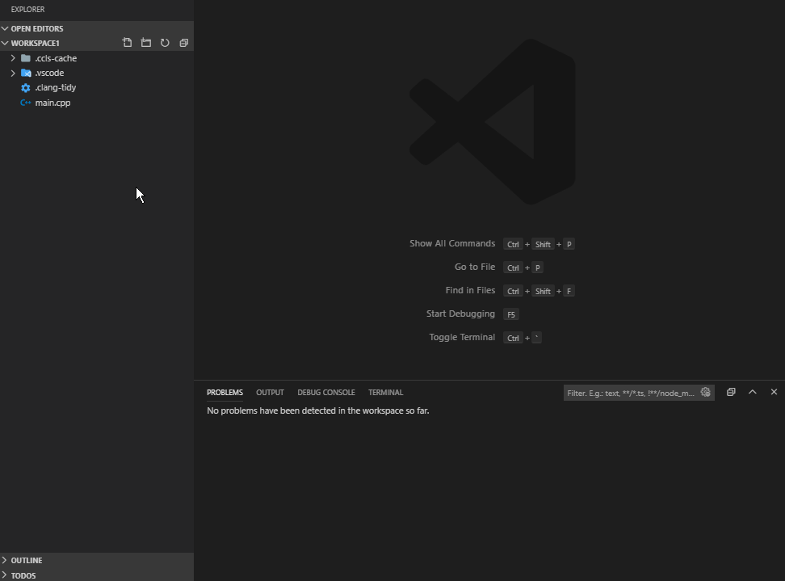

# Clang-Tidy for VSCode

This extension integrates [clang-tidy](https://clang.llvm.org/extra/clang-tidy/) into VS Code.

This project is forked from notskm/vscode-clang-tidy. Added support for using a .clang-tidy config file as well as a specific setting for include directories.

[Clang-Tidy documentation can be found here.](https://clang.llvm.org/extra/clang-tidy/)

## Features

Runs clang-tidy and displays its diagnostics in VS Code.

Note: Diagnostics take longer to appear than in the example gif.

## Requirements

Clang-Tidy must be installed. The extension will look for the clang-tidy executable in your `PATH` by default.

Clang-Tidy is part of LLVM, which can be [downloaded here.](https://releases.llvm.org/download.html) Alternatively, use your system's package manager.

## Extension Settings

This extension contributes the following settings:

-   `clang-tidy.executable`: The path to the clang-tidy executable
-   `clang-tidy.configFile`: Path to a .clang-tidy file
-   `clang-tidy.checks`: List of checks to enable or disable
-   `clang-tidy.includePaths`: List of extra paths to use when searching for included files
-   `clang-tidy.compilerArgs`: List of arguments to append to the compiler command line
-   `clang-tidy.compilerArgsBefore`: List of arguments to prepend to the compiler command line
-   `clang-tidy.lintOnSave`: Whether or not to lint files when they are saved
-   `clang-tidy.buildPath`: Path to the build folder. Equivalent to clang-tidy -p /path
-   `clang-tidy.fixOnSave`: Whether or not to fix files when they are saved
-   `clang-tidy.blacklist`: A list of regular expressions matching files you don't want to lint

## Extension Commands

This extension contributes the following commands:

-   `Clang-Tidy: Lint File`: Lints the active file

## Known Issues

[See the Github issues](https://github.com/zoey-ada/vscode-clang-tidy/issues)
